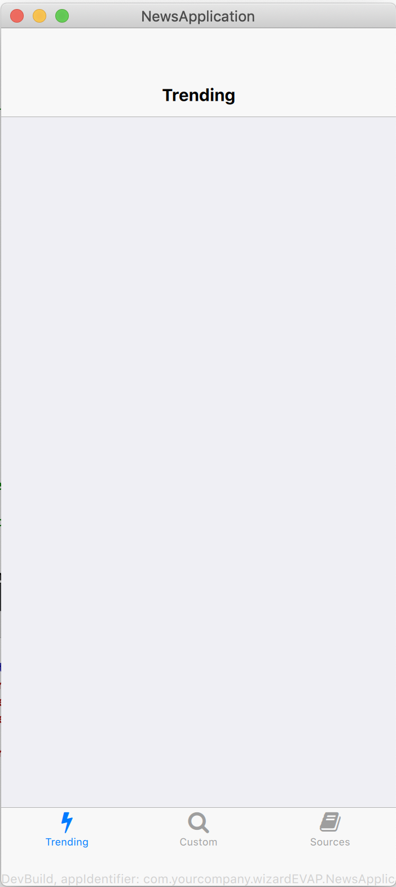
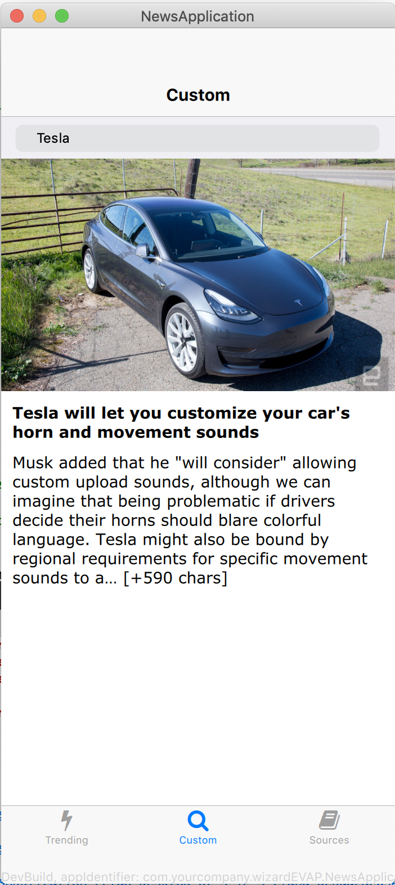
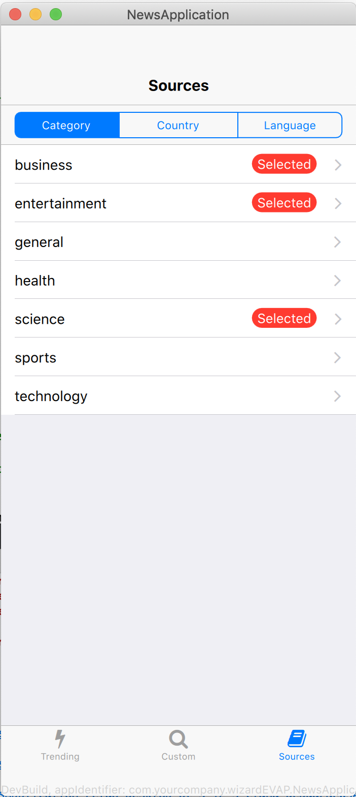
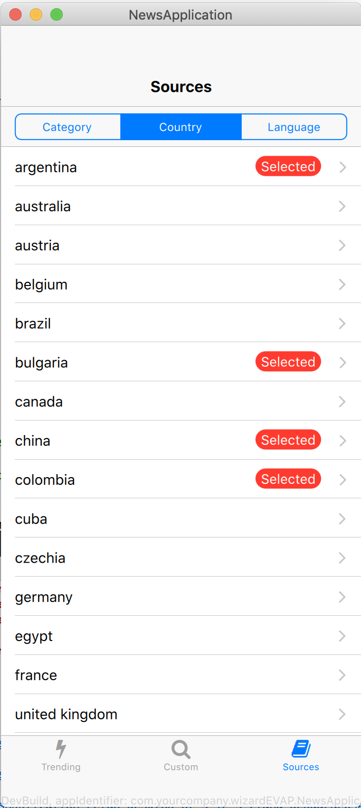
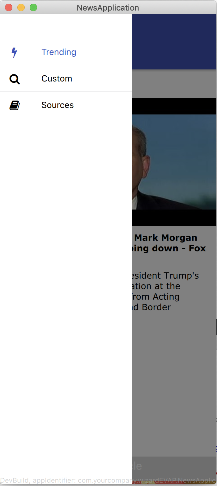
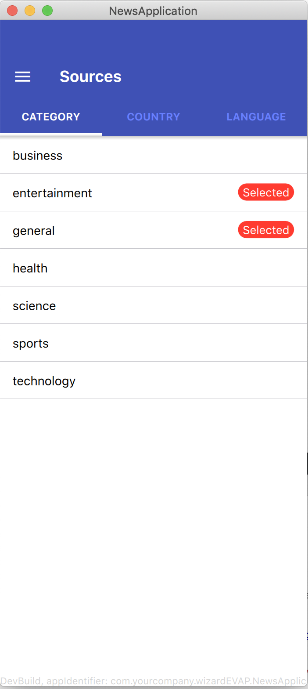
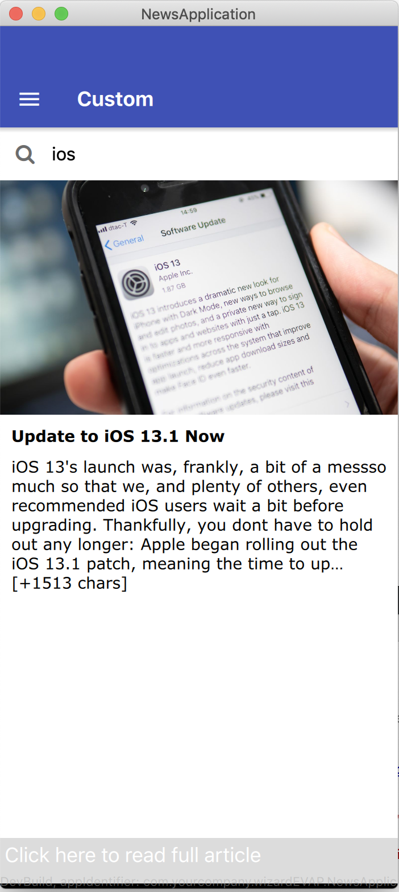
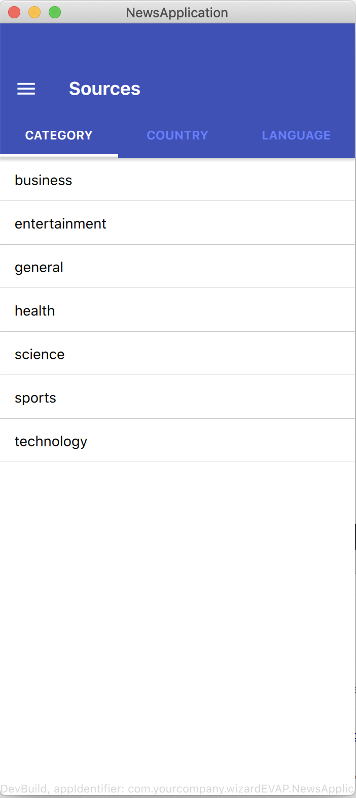

## NewsApp

A cross platform news application written in C++/Qt/QML, uses REST services to querry various endpoints from NewsAPI 

### IOS
<table width = "100%">
<td></td>
<td align = "center"></td>
<td align = "right"></td>
</table>
 
<table width = "100%">
<td></td>
<td align = "center"></td>
<td align = "right"></td>
</table>

 
 

### Android
<table width = "100%">
<td></td>
<td align = "center"></td>
<td align = "right"></td>
</table>
 
<table width = "100%">
<td></td>
<td align = "center"></td>
<td align = "right"></td>
</table>
